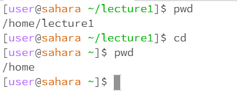
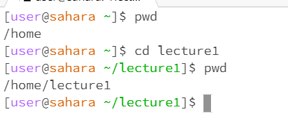
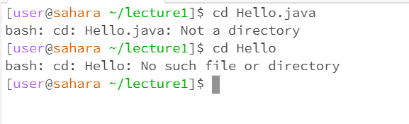
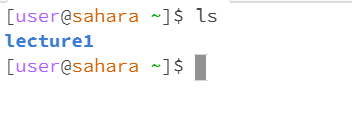
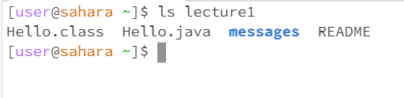
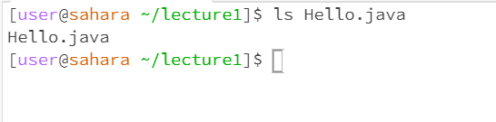
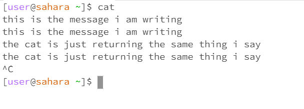
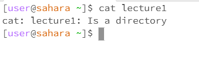
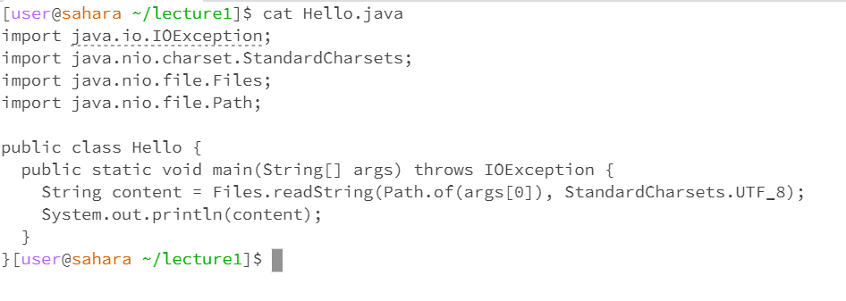

First, let us take a look at the change directory command.

Psst. Why are wine experts called sommeliers? Because they suh-mell-uh-the-air

1.   
   Here, we used the cd command with no arguments. This resulted in us leaving the directory.  
2.   
  Here we used the cd command with a path to a directory. This resulted in us entering that directory. 
3.   
   Here, we used the cd command with a path to file. This was not very smart of us since the cd feels about paths to files the same way i feel about midterms(not good). Thus, it resulted in an error.

Now let's move onto the ls command(I always read this as 1s).

1.   
  I was using "Here" too much, so in this image we have ls with no argument. This resulted in the terminal returning a list of available directories.
2.   
   In this image, we used the ls command with an argument passed. The argument passed in this instance was a directory, so the ls command returned a list of contents in the directory.
3.   
   In this image, we used the ls command with the argument passed being a file. Consquently, the ls command just returned the file name of the file I referenced since that is the only file in the file.

Finally, let's move onto the cat command - not the fun cat.

1.   
   We gotta change up the starting phrase one more time, so let's go with As shown above. As shown above, I used the cat statement with no arguments passed. This then prompted me to enter any string I wanted and it would return the same string.
2.   
   As shown above, I tried running the cat command with a reference to a directory. It told me that the directory I gave it was indeed a directory. Riveting. 
3.   
   As shown above, I ran the cat command with a reference to a file. It returned the code in the file. This was actually riveting(no it wasn't).

Thank you for grading my lab. Yours truly,
    Rishi Gupta
