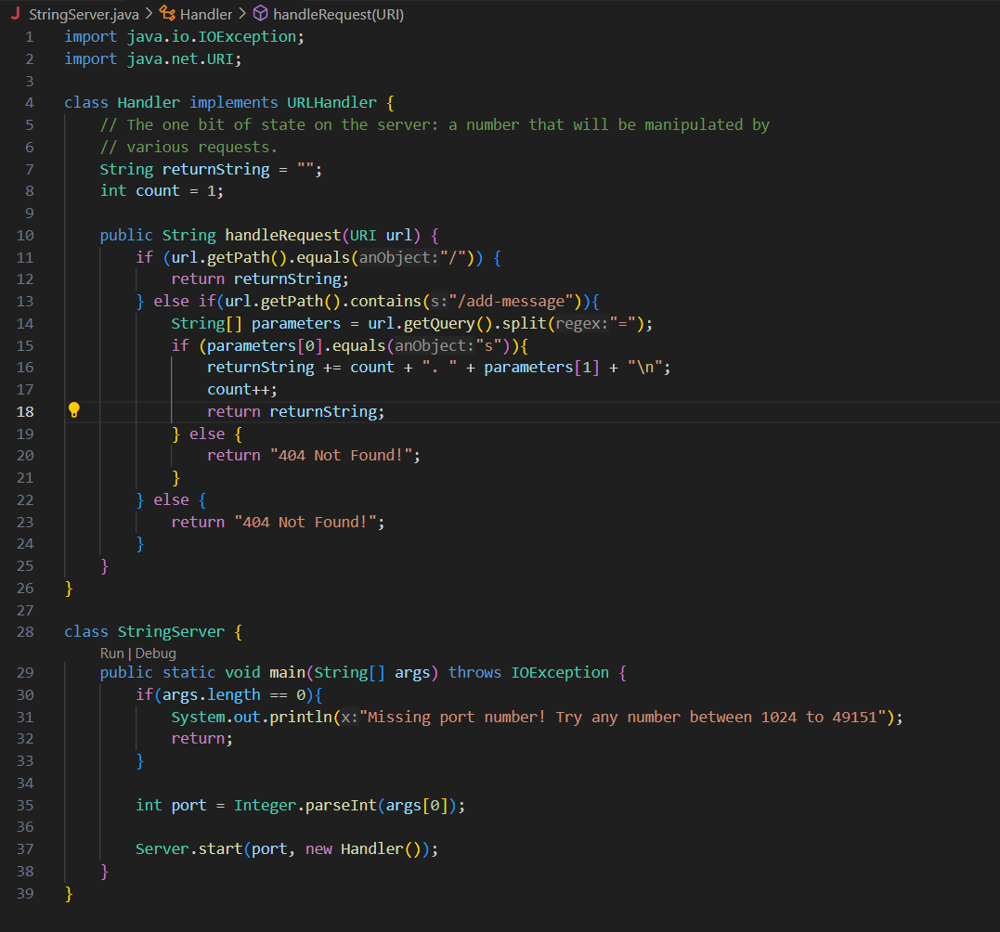
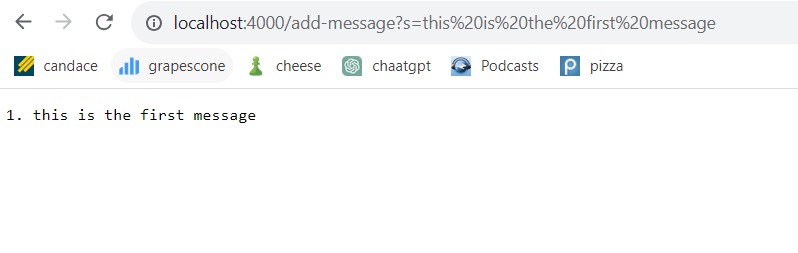
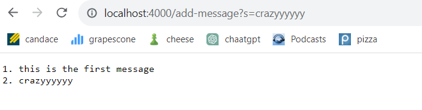
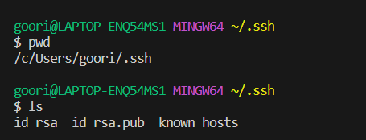
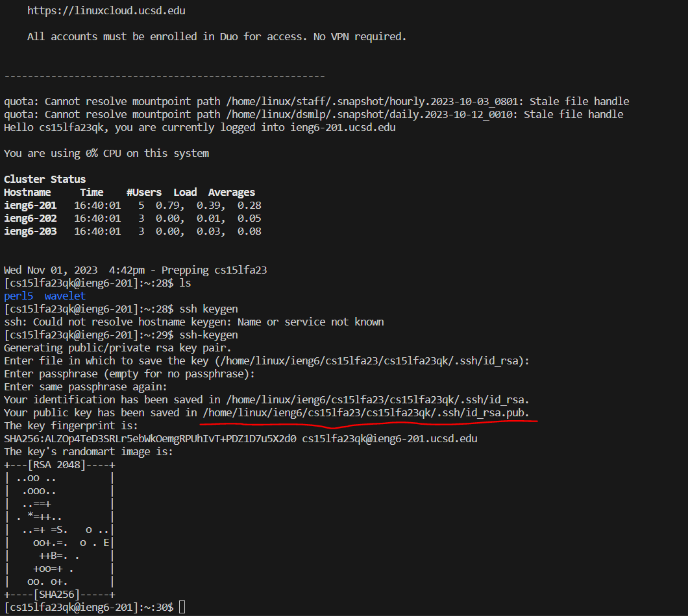

Hello, welcome to my second lab. Let's take a look at my code for `StringServer`.

Psst. What's Blue and not heavy? (Scroll to the end for the answer)

## Part 1 - `StringServer`

  

Here, we have the code for `StringServer`. Not much to see here, let's take a look at the screenshots of `/add-message` in action.

  
 
  

Here, we have some screenshots of `StringServer` in action. `HandleRequest()` gets called to process the requests in the url. The argument relevant to `HandleRequest()` is the path in the url and the subsequeny query, if there is one. We can also take a look at `returnString` and `count`, whose values change after these calls. `returnString` goes from "" to "1. this is the first message" to "1. this is the first message \n 2. crazyyyyyy \n" and `count` goes from 1 to 2 to 3. With the way count is coded in, the value of count is one higher than the number seen in `returnString` and that's just a stylistic choice where I set count equal to 1 initially and increment it after using it in `returnString`.

## Part 2 - `ls`

  

Above, we can see the path to both the public and private key for my SSH key for logging into ieng6. Very cool.

  

Finally, we see me able to log in without needing to type in my password. Good thing it worked because I do not remember my password.

## Part 3 - Finishing Thoughts

Overall I feel like I have definitely gotten more comfortable dealing with directories and traversing them. One useful thing I learned was creating mini servers quickly and easily. That feels like it could be very useful when creating other projects since it is a lot easier than getting some third party to host while creating and testing a program.  

Thank you for grading my second lab! Yours Truly,

Rishi Gupta 

Answer: Light Blue
